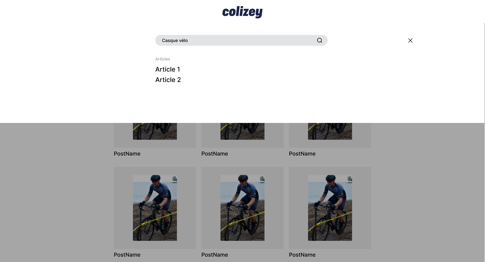
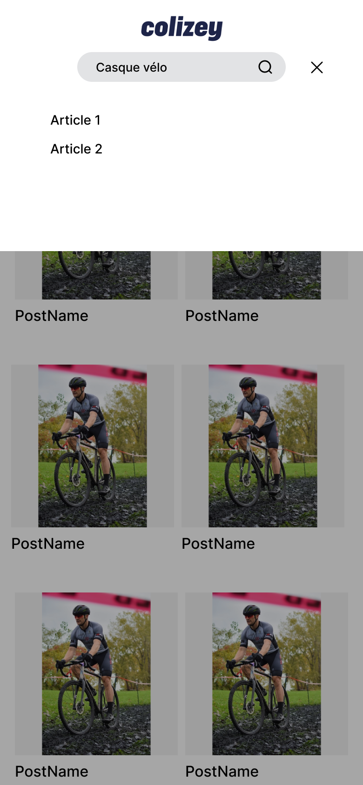

## Installation

* lancer les images docker
* installer la base de données (`doctrine:schema:update`) et lancer les fixtures (`doctrine:fixtures:load`)
* installer les dépendances js (`npm install`) et build les assets (`npm run dev`)
* accéder au projet : https://localhost:4000

## Note
Pour les routes AJAX j'ai utilisé une solution à la mano j'aurais pu utilisé friendsofsymfony/jsrouting-bundle 

## Tests
Entrer une valeur dans la barre de recherche puis cliquez sur le bouton recherche, j'ai pas
trop compris l'affichage des resultats de posts sous la barre de recherche qui contraste
avec le TODO de la page d'affichage des resultats.

## Demo

Voilà une idée de maquette fonctionnelle :

Un Makefile est également disponible !
